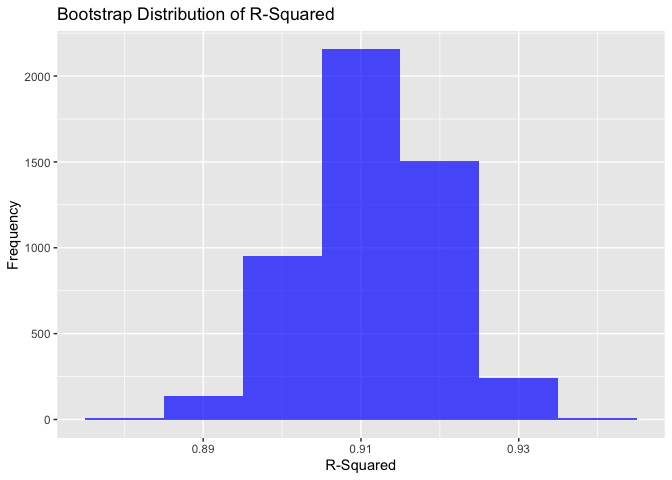
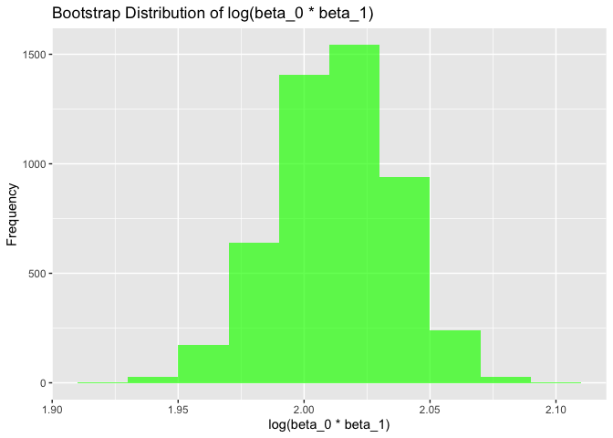
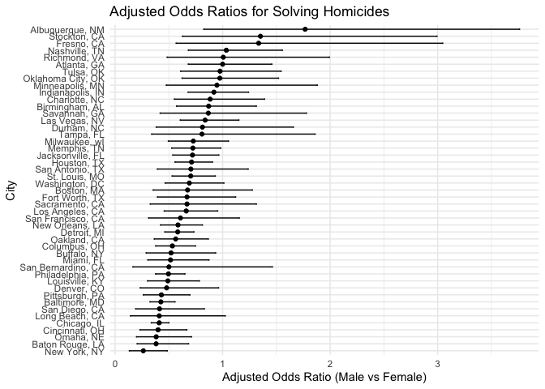
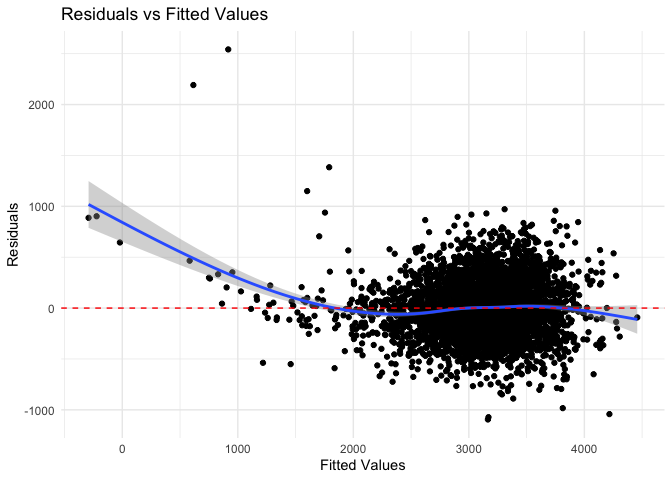
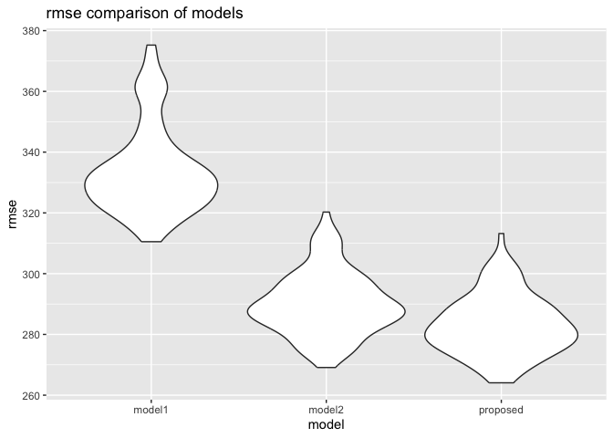

p8105_hw6_jg4890
================
Jiayi Ge
2024-12-02

# Problem 1

Load Libraries and Data

``` r
library(tidyverse)
```

    ## ── Attaching core tidyverse packages ──────────────────────── tidyverse 2.0.0 ──
    ## ✔ dplyr     1.1.4     ✔ readr     2.1.5
    ## ✔ forcats   1.0.0     ✔ stringr   1.5.1
    ## ✔ ggplot2   3.5.1     ✔ tibble    3.2.1
    ## ✔ lubridate 1.9.3     ✔ tidyr     1.3.1
    ## ✔ purrr     1.0.2     
    ## ── Conflicts ────────────────────────────────────────── tidyverse_conflicts() ──
    ## ✖ dplyr::filter() masks stats::filter()
    ## ✖ dplyr::lag()    masks stats::lag()
    ## ℹ Use the conflicted package (<http://conflicted.r-lib.org/>) to force all conflicts to become errors

``` r
library(broom)
library(rsample)

weather_df <- rnoaa::meteo_pull_monitors(
  c("USW00094728"),
  var = c("PRCP", "TMIN", "TMAX"),
  date_min = "2017-01-01",
  date_max = "2017-12-31"
) %>%
  mutate(
    name = recode(id, USW00094728 = "CentralPark_NY"),
    tmin = tmin / 10,
    tmax = tmax / 10
  ) %>%
  select(name, id, everything())
```

    ## using cached file: /Users/nina/Library/Caches/org.R-project.R/R/rnoaa/noaa_ghcnd/USW00094728.dly
    ## date created (size, mb): 2024-12-02 13:03:58.447792 (8.667)
    ## file min/max dates: 1869-01-01 / 2024-11-30

Bootstrap Analysis

``` r
set.seed(123)

bootstrap_samples <- bootstraps(weather_df, times = 5000)

bootstrap_metrics <- function(split) {

  sample_data <- analysis(split)
  
  model <- lm(tmax ~ tmin, data = sample_data)
  
  r_squared <- glance(model)$r.squared
  
  coefs <- tidy(model) %>% pull(estimate)
  
  log_beta_product <- log(coefs[1] * coefs[2])
  
  return(tibble(r_squared = r_squared, log_beta_product = log_beta_product))
}

bootstrap_results <- bootstrap_samples %>%
  mutate(metrics = map(splits, bootstrap_metrics)) %>%
  unnest(metrics)
```

Plot Distributions

``` r
ggplot(bootstrap_results, aes(x = r_squared)) +
  geom_histogram(binwidth = 0.01, fill = "blue", alpha = 0.7) +
  labs(
    title = "Bootstrap Distribution of R-Squared",
    x = "R-Squared",
    y = "Frequency"
  )
```

<!-- -->

``` r
ggplot(bootstrap_results, aes(x = log_beta_product)) +
  geom_histogram(binwidth = 0.02, fill = "green", alpha = 0.7) +
  labs(
    title = "Bootstrap Distribution of log(beta_0 * beta_1)",
    x = "log(beta_0 * beta_1)",
    y = "Frequency"
  )
```

<!-- -->

Confidence Intervals

``` r
conf_intervals <- bootstrap_results %>%
  summarize(
    r_squared_lower = quantile(r_squared, 0.025),
    r_squared_upper = quantile(r_squared, 0.975),
    log_beta_product_lower = quantile(log_beta_product, 0.025),
    log_beta_product_upper = quantile(log_beta_product, 0.975)
  )
print(conf_intervals)
```

    ## # A tibble: 1 × 4
    ##   r_squared_lower r_squared_upper log_beta_product_lower log_beta_product_upper
    ##             <dbl>           <dbl>                  <dbl>                  <dbl>
    ## 1           0.895           0.927                   1.96                   2.06

# Problem 2

``` r
library(tidyverse)
library(broom)
library(purrr)
library(dplyr)

url <- "https://raw.githubusercontent.com/washingtonpost/data-homicides/master/homicide-data.csv"
homicides <- read_csv(url)
```

    ## Rows: 52179 Columns: 12
    ## ── Column specification ────────────────────────────────────────────────────────
    ## Delimiter: ","
    ## chr (9): uid, victim_last, victim_first, victim_race, victim_age, victim_sex...
    ## dbl (3): reported_date, lat, lon
    ## 
    ## ℹ Use `spec()` to retrieve the full column specification for this data.
    ## ℹ Specify the column types or set `show_col_types = FALSE` to quiet this message.

``` r
homicides <- homicides %>%
  mutate(victim_age = as.numeric(victim_age)) %>%
  filter(!(city == "Dallas" & state == "TX"),
         !(city == "Phoenix" & state == "AZ"),
         !(city == "Kansas City" & state == "MO"),
         !(city == "Tulsa" & state == "AL")) %>%
  filter(victim_race %in% c("White", "Black")) %>%
  filter(!is.na(victim_age)) %>%
  mutate(city_state = paste(city, state, sep = ", "),
         solved_binary = ifelse(disposition == "Closed by arrest", 1, 0))
```

    ## Warning: There was 1 warning in `mutate()`.
    ## ℹ In argument: `victim_age = as.numeric(victim_age)`.
    ## Caused by warning:
    ## ! NAs introduced by coercion

``` r
print(homicides)
```

    ## # A tibble: 39,403 × 14
    ##    uid        reported_date victim_last  victim_first victim_race victim_age
    ##    <chr>              <dbl> <chr>        <chr>        <chr>            <dbl>
    ##  1 Alb-000003      20100601 SATTERFIELD  VIVIANA      White               15
    ##  2 Alb-000005      20100102 MULA         VIVIAN       White               72
    ##  3 Alb-000006      20100126 BOOK         GERALDINE    White               91
    ##  4 Alb-000009      20100130 MARTIN-LEYVA GUSTAVO      White               56
    ##  5 Alb-000016      20100308 GRAY         STEFANIA     White               43
    ##  6 Alb-000018      20100323 DAVID        LARRY        White               52
    ##  7 Alb-000019      20100402 BRITO        ELIZABETH    White               22
    ##  8 Alb-000021      20100423 KING         TEVION       Black               15
    ##  9 Alb-000022      20100423 BOYKIN       CEDRIC       Black               25
    ## 10 Alb-000023      20100518 BARRAGAN     MIGUEL       White               20
    ## # ℹ 39,393 more rows
    ## # ℹ 8 more variables: victim_sex <chr>, city <chr>, state <chr>, lat <dbl>,
    ## #   lon <dbl>, disposition <chr>, city_state <chr>, solved_binary <dbl>

Logistic regression for Baltimore, MD

``` r
baltimore <- homicides %>%
  filter(city_state == "Baltimore, MD")

baltimore_model <- glm(
  solved_binary ~ victim_age + victim_sex + victim_race,
  family = "binomial",
  data = baltimore
)
baltimore_results <- broom::tidy(baltimore_model, conf.int = TRUE) %>%
  filter(term == "victim_sexMale") %>%
  mutate(
    adj_odds_ratio = exp(estimate),
    conf.low = exp(conf.low),
    conf.high = exp(conf.high)
  )

print(baltimore_results)
```

    ## # A tibble: 1 × 8
    ##   term   estimate std.error statistic  p.value conf.low conf.high adj_odds_ratio
    ##   <chr>     <dbl>     <dbl>     <dbl>    <dbl>    <dbl>     <dbl>          <dbl>
    ## 1 victi…   -0.854     0.138     -6.18 6.26e-10    0.324     0.558          0.426

Logistic regression for all cities

``` r
city_results <- homicides %>%
  group_by(city_state) %>%
  nest() %>%
  mutate(
    model = map(data, ~ glm(
      solved_binary ~ victim_age + victim_sex + victim_race,
      family = "binomial",
      data = .
    )),
    results = map(model, ~ broom::tidy(., conf.int = TRUE) %>%
      filter(term == "victim_sexMale") %>%
      mutate(
        adj_odds_ratio = exp(estimate),
        conf.low = exp(conf.low),
        conf.high = exp(conf.high)
      ))
  ) %>%
  unnest(results)
```

    ## Warning: There were 44 warnings in `mutate()`.
    ## The first warning was:
    ## ℹ In argument: `results = map(...)`.
    ## ℹ In group 1: `city_state = "Albuquerque, NM"`.
    ## Caused by warning:
    ## ! glm.fit: fitted probabilities numerically 0 or 1 occurred
    ## ℹ Run `dplyr::last_dplyr_warnings()` to see the 43 remaining warnings.

``` r
city_results %>%
  ggplot(aes(x = reorder(city_state, adj_odds_ratio), y = adj_odds_ratio)) +
  geom_point() +
  geom_errorbar(aes(ymin = conf.low, ymax = conf.high), width = 0.2) +
  coord_flip() +
  labs(
    title = "Adjusted Odds Ratios for Solving Homicides",
    x = "City",
    y = "Adjusted Odds Ratio (Male vs Female)"
  ) +
  theme_minimal()
```

<!-- --> The
plot visualizes the adjusted odds ratios (ORs) for solving homicides
involving male versus female victims across various U.S. cities. The
horizontal line segments indicate the 95% confidence interval for the
OR.

#### Trend in Odds Ratios:

**Majority Below 1**: Most cities exhibit ORs below 1, suggesting that
homicides involving male victims are generally less likely to be solved
compared to those involving female victims.

**Variation Across Cities**: However, there is considerable variation in
the magnitude of these differences across cities. Some cities, like
Baltimore, show a pronounced difference, while others, like New York,
have a more modest difference.

#### Confidence Intervals:

**Width and Precision**: The width of the confidence intervals varies
across cities. Narrower intervals, like those for Baltimore, indicate
more precise estimates. Wider intervals, such as those for Albuquerque
and Stockton, suggest greater uncertainty in the OR estimate.

**Statistical Significance**: If the confidence interval for a city does
not include 1, it indicates a statistically significant difference in
the odds of solving homicides between male and female victims.

#### Potential Factors Influencing ORs:

**Local Law Enforcement Practices**: Differences in investigative
techniques, resource allocation, and prioritization of cases across
police departments may influence the likelihood of solving homicides.
Socioeconomic Factors: Factors like poverty, crime rates, and community
engagement can impact the resources available for investigations and the
cooperation of witnesses.

**Victim Characteristics**: Beyond sex, factors like age, race, and
socioeconomic status may also influence the likelihood of a homicide
being solved.

# Problem3

``` r
library(tidyverse)
library(modelr)
```

    ## 
    ## Attaching package: 'modelr'

    ## The following object is masked from 'package:broom':
    ## 
    ##     bootstrap

``` r
library(broom)
library(crossval)
library(purrr)

birthweight <- read_csv("./data/birthweight.csv")
```

    ## Rows: 4342 Columns: 20

    ## ── Column specification ────────────────────────────────────────────────────────
    ## Delimiter: ","
    ## dbl (20): babysex, bhead, blength, bwt, delwt, fincome, frace, gaweeks, malf...
    ## 
    ## ℹ Use `spec()` to retrieve the full column specification for this data.
    ## ℹ Specify the column types or set `show_col_types = FALSE` to quiet this message.

``` r
birthweight <- birthweight %>%
  mutate(
    babysex = factor(babysex, labels = c("Male", "Female")),
    malform = factor(malform, labels = c("Absent", "Present")),
    frace = factor(frace),
    mrace = factor(mrace)
  ) %>%
  drop_na()

model_proposed <- lm(bwt ~ babysex + bhead + blength + delwt + gaweeks + wtgain, data = birthweight)

birthweight <- birthweight %>%
  add_predictions(model_proposed, var = "predicted") %>%
  add_residuals(model_proposed, var = "residuals")

residual_plot <- birthweight %>%
  ggplot(aes(x = predicted, y = residuals)) +
  geom_point() +
  geom_smooth() +
  geom_hline(yintercept = 0, color = "red", linetype = "dashed") +
  labs(title = "Residuals vs Fitted Values", x = "Fitted Values", y = "Residuals") +
  theme_minimal()

print(residual_plot)
```

    ## `geom_smooth()` using method = 'gam' and formula = 'y ~ s(x, bs = "cs")'

<!-- -->

#### Modeling process

The dataset was cleaned by converting categorical variables (`babysex`,
`frace`, `mrace`, `malform`) into factors to allow appropriate
statistical modeling. Missing data were dropped to ensure analysis
integrity. The dependent variable, `bwt` (birth weight), remained
numeric for regression analysis.

A multiple linear regression model was developed to predict birth weight
using hypothesized influential factors: `bhead`, `blength`, `gaweeks`,
`delwt`, and `wtgain`. These variables were chosen based on biological
plausibility and domain knowledge about factors influencing fetal
growth.

Residuals and predicted values were computed using `add_predictions()`
and `add_residuals()`. The residual plot revealed residuals scattered
around zero, indicating no severe violations of linearity or
heteroscedasticity. In addition, slight deviations were noted at extreme
fitted values, may hint at potential model refinements.

**Comparison models**

``` r
# Model 1: Length at birth and gestational age (main effects only)
comparison_model_1 <- lm(bwt ~ blength + gaweeks, data = birthweight)

# Model 2: Head circumference, length, sex, and all interactions (including three-way)
comparison_model_2 <- lm(bwt ~ bhead * blength * babysex, data = birthweight)
```

``` r
cv_df <- crossv_mc(birthweight, 100) |>
  mutate(
    train = map(train, as_tibble),
    test = map(test, as_tibble)
  )

cv_res <- cv_df |>
  mutate(
    model_proposed = map(train, ~lm(bwt ~ babysex + bhead + blength + delwt + gaweeks + wtgain, data = .x)),
    comparison_model_1 = map(train, ~lm(bwt ~ blength + gaweeks, data = .x)),
    comparison_model_2 = map(train, ~lm(bwt ~ bhead * blength * babysex, data = .x)),
    rmse_proposed = map2_dbl(model_proposed, test, ~rmse(.x, .y)),
    rmse_model1 = map2_dbl(comparison_model_1, test, ~rmse(.x, .y)),
    rmse_model2 = map2_dbl(comparison_model_2, test, ~rmse(.x, .y))
  )

cv_res |>
  select(starts_with("rmse")) |>
  pivot_longer(
    everything(),
    names_to = "model",
    values_to = "rmse",
    names_prefix = "rmse_"
  ) |>
  ggplot(aes(x = model, y = rmse)) +
  geom_violin() +
  labs(
    title = "rmse comparison of models",
    x = "model",
    y = "rmse"
  )
```

<!-- -->

The violin plot visualizes the distribution of RMSE values for three
different regression models across 100 cross-validation folds. The
proposed model demonstrates the lowest RMSE values, indicating superior
predictive performance compared to Model 1 (using only length at birth
and gestational age) and Model 2 (using head circumference, length, sex,
and all their interactions). This may suggest that the inclusion of
additional relevant factors in the proposed model enhances its
predictive accuracy for birthweight.
